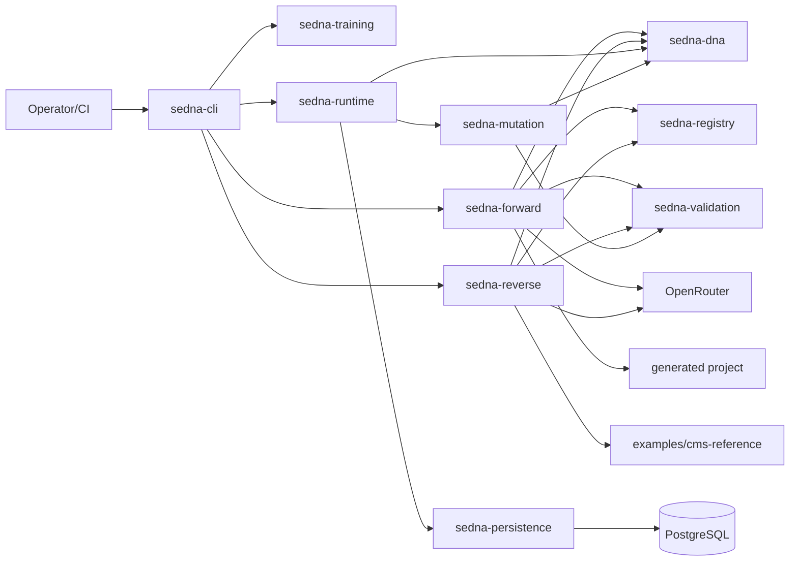

# SEDNA — Detailed Design Document

**Subtitle:** Technical specification (contract for implementation)

| Field | Value |
|-------|-------|
| **System class** | API-only / Developer platform · Greenfield |
| **Audience segment** | Internal / Enterprise-tool (AI agents + platform engineers) |
| **Domain profile** | Developer tooling / semantic platform · General security (no regulated PHI/PCI scope) |
| **Scope** | Local deterministic semantic DNA platform: encode/decode, forward/reverse pipelines, DAG runtime, mutation, validation, training dataset generation for Spring Boot monoliths |
| **Out of scope** | Distributed runtime, Kafka, Kubernetes orchestration, multi-language codegen, IntelliJ plugin, visualization UI, cross-project semantic linking, in-process LLM |
| **Document version** | 1.1 |
| **Status** | Production-ready (implementation contract) |

### Version history

| Version | Date | Changes |
|---------|------|---------|
| 1.0 | 2026-05-19 | Initial detailed design from specification suite |
| 1.1 | 2026-05-19 | Review fixes (FR-dna canonical encode, checkpoint TLV format, FR-rt.05/06, OpenRouter defaults); FR numbering policy |

### Artifact inventory (traceability)

| ID | Type | Maturity | Source | Role |
|----|------|----------|--------|------|
| A1 | T2 | L3 | `README.md` | Product overview, stack, performance targets |
| A2 | T2 | L3 | `AGENTS.md` | Agent rules, DTO canon, bootstrap, determinism, module order |
| A3 | T2 | L3 | `ROADMAP.md` | Phased delivery, acceptance criteria, release plan |
| A4 | T2 | L3 | `docs/sedna_technical_assignment.md` (v1.0) | Implementation contract, interfaces, phases, security |
| A5 | T2 | L4 | `docs/sedna_formal_semantic_specification.md` (v1.0) | Genome grammar, hypergraph, contracts, mutation semantics |
| A6 | T2 | L3 | `docs/sedna_forward_pipeline_specification.md` (v1.0) | Forward pipeline stages and determinism boundary |
| A7 | T2 | L3 | `docs/sedna_reverse_pipeline_specification.md` (v1.0) | Reverse pipeline stages, Git trajectories |
| A8 | T2 | L3 | `docs/sedna_training_pipeline_specification.md` (v1.0) | Training dataset pipeline |
| A9 | T2 | L3 | `docs/sedna_execution_semantics_runtime_model.md` (v1.0) | Runtime profiles, replay, checkpointing |

---

# SECTION 1 — FOR THE TEAM

## 1.1 Summary (TL;DR)

The project goal is the development of **SEDNA** (Semantic DNA Runtime & Transformation System): a local, deterministic platform that represents Spring Boot applications as compact binary semantic DNA and reconstructs executable projects from that DNA.

The target users are AI development agents and platform engineers who need reproducible semantic graphs, contract-first codegen, and verifiable round-trips (`reverse → forward` preserves semantic equivalence).

Core value: **executable semantics stored separately from source text**, with canonical NodeIDs, stable TLV serialization, and DAG runtime execution.

Scope in one line: Java 21 multi-module Gradle platform covering DNA, registry, validation, forward/reverse/training pipelines, mutation, persistence, and CLI—reference target `examples/cms-reference`.

## 1.2 Context and goals

### Business context

Teams using LLM-assisted development lack a machine-verifiable contract between intent and generated code. SEDNA addresses this by fixing structure (graph, contracts, constraints, NodeIDs) deterministically while allowing bounded non-determinism only at method-body synthesis.

### System goals (measurable)

| # | Goal | Metric |
|---|------|--------|
| G1 | Stable DNA round-trip | `encode(decode(dna)) == dna` byte-identical; 100% on reference tests |
| G2 | Deterministic forward output | Same DNA → identical generated tree hash across 10 consecutive runs |
| G3 | Semantic-preserving reverse | `reverse(forward(dna))` meets equivalence rules (node set, contracts, constraints, topology) |
| G4 | Performance on reference CMS | DNA decode p95 <100ms; forward <5s; reverse <30s on warmed 4-core/16GB JVM |
| G5 | Agent-safe module boundaries | 100% public cross-module APIs return `Result<T, SemanticError>`; zero raw exceptions across boundaries |

### Anti-goals

- The system does **not** provide multi-tenant SaaS, end-user authentication, or billing.
- The system does **not** run distributed orchestration, Kafka, or Kubernetes deployment (Phase 15).
- The system does **not** allow LLMs to assign NodeIDs, define contracts/constraints, or mutate graph topology.
- The system does **not** perform cross-project or repository-wide semantic merging.
- The system does **not** ship a web/mobile UI or IntelliJ plugin (Phase 14).
- The system does **not** guarantee identical method bodies across runs when LLM enrichment is enabled (structure remains deterministic).

## 1.3 Functional architecture and differentiation

### 1.3.A Three-layer model

| Layer | Criterion | Functions |
|-------|-----------|-----------|
| **Differentiating Core** | Remove → product is generic codegen | Semantic DNA TLV, deterministic NodeID, typed hypergraph + late binding, bidirectional Spring reconstruction, replayable DAG runtime |
| **Enabling** | Remove → core cannot run | `sedna-core` DTOs, registry bootstrap, validation engine, canonical ordering, `Result` error boundary, Gradle multi-module CI |
| **Periphery** | Remove → core still works; operators complain | JMH benchmarks, extended training corpus tooling, optional FAISS indexing, documentation synthesis via LLM |

### 1.3.B Differentiating Core (detail)

#### Semantic DNA binary genome (TLV + stable NodeID)

**Description:** Compact binary representation of a software system’s executable semantics, not source files.

**Mechanism:** Little-endian TLV framing per node; NodeID = first 64 bits of SHA-256 over canonical node content; child and field ordering via `CanonicalOrdering.comparator()`; vocabulary/registry version stamped on graph.

**Why it works:** Competitors store AST snapshots or text—diff-heavy and JVM-order-sensitive. SEDNA fixes identity and serialization independently of classpath iteration order.

**Key risk:** Any unordered collection in encode path breaks byte identity. Mitigation: forbid `HashMap`/`HashSet` iteration in hot paths; golden-byte tests per module.

#### Typed semantic hypergraph with capability late binding

**Description:** Nodes (ENTITY, SERVICE, CONTROLLER, etc.) linked by semantic references resolved to providers at contract-resolution time.

**Mechanism:** LINKS remain semantic capability references until Forward Step 4 / Runtime binding; resolution order: exact match → compatible version → nearest provider (warning on fallback).

**Why it works:** Enables motif folding and contract substitution without rewriting physical dependency graphs.

**Key risk:** Ambiguous providers. Mitigation: STRICT binding default; validation fails on unresolved capabilities.

#### Bidirectional Spring Boot reconstruction

**Description:** `reverse`: project → DNA; `forward`: DNA → Gradle Spring Boot project.

**Mechanism:** Reverse: Spoon/ASM/Gradle → structural graph → semantic extraction → motif fold → TLV. Forward: TLV → hypergraph → contract/constraint propagation → topological plan → JavaPoet + Mustache (+ optional HTTP LLM for method bodies only).

**Why it works:** Round-trip equivalence is machine-testable; agents implement against frozen DTOs in `sedna-core`.

**Key risk:** LLM body drift. Mitigation: empty skeleton fallback; bodies excluded from semantic equivalence checks.

#### Deterministic DAG runtime with replay

**Description:** Execute semantic graphs locally with canonical scheduling and checkpoint/replay.

**Mechanism:** Topological order with NodeID lexicographic tie-break; Project Reactor with dependency-aware sequencing; PostgreSQL append-only checkpoints; replay excludes timestamps/external HTTP payloads.

**Why it works:** Same ordering algorithm as forward planning—replay matches validation order.

**Key risk:** Profile complexity. Mitigation: DAG profile shipped in v1.0 foundation; STATEFUL/SUPERVISOR in Phase 12 per ROADMAP.

### 1.3.C Enabling (compact)

- Canonical DTOs (`SemanticGraph`, `GenomeNode`, `SemanticLink`, `Contract`, `Constraint`, `ExecutionToken`, `Mutation`, `MutationResult`, `SemanticError`) in `sedna-core` only.
- Embedded core vocabulary + registry extension decode at bootstrap.
- `sedna-validation`: topology, contracts, constraints, motifs, capability resolution, ordering.
- Mutation subtree scope: parent + recursive CHILDREN + local LINKS only.
- Bootstrap sequence per AGENTS.md (7 steps).
- HTTP-sandboxed LLM for UNKNOWN enrichment and method bodies only.

### 1.3.D Periphery (compact)

- JMH benchmark suite and fuzz tests (Phase 7).
- Training corpus analytics (20–30 min projects, 100–300 recommended).
- Phase 14: IntelliJ plugin, graph visualization; Phase 13: FAISS indexing.
- Apache License 2.0 (`LICENSE`).

### 1.3.E Comparison (Differentiating Core criteria)

| Criterion | SEDNA | OpenAPI + codegen | AST clone (Spoon refactor) | Plain LLM codegen |
|-----------|-------|-------------------|----------------------------|-------------------|
| Semantic identity stable across JVM restarts | SHA-256 NodeID, canonical bytes | N/A (schema-only) | No canonical genome | No |
| Round-trip project ↔ semantics | Target equivalence suite | One-way | Lossy | Non-reproducible |
| LLM bounded to safe surface | Structure frozen; bodies optional | N/A | N/A | Full stack |
| Replayable execution order | DAG + checkpoint replay | N/A | N/A | N/A |
| Agent contract (`Result`, frozen DTOs) | Mandatory | Varies | Varies | None |

### 1.3.F Segment adaptation (Internal-tool)

Comparison targets **current team practice** (manual Spring templates, unconstrained LLM edits, ArchUnit-only checks) rather than consumer competitors. Success = fewer agent regressions and measurable equivalence tests in CI.

## 1.4 Users and roles

| Role | Who | Primary activities | Key permissions |
|------|-----|-------------------|---------------|
| **Platform engineer** | Human maintainer | Module implementation, benchmark tuning, registry curation | Full repo; defines vocabulary/motif releases |
| **AI development agent** | Autonomous implementer | Implements modules per AGENTS.md order; runs tests | Write code via PR; cannot break DTO canon or determinism rules |
| **Pipeline operator** | Human or CI job | Runs reverse/forward/training CLI | Read projects; write `.sdna` and `generated/` outputs |
| **Validator** | CI system | Runs determinism, replay, equivalence suites | Read-only execution; fails build on non-determinism |

Single interactive “end user” role is not applicable; RBAC matrix is reduced to operational vs read-only automation.

## 1.5 Key scenarios

> **Scenario 1: Reverse existing CMS to DNA**  
> **Actor:** Pipeline operator · **Trigger:** New reference project available  
> 1. Operator points CLI at `examples/cms-reference` Gradle root.  
> 2. Reverse pipeline parses sources (Spoon), builds structural then semantic graph.  
> 3. Contracts and constraints reconstructed; motifs folded.  
> 4. Graph validated; canonical ordering applied.  
> 5. Encoder emits `cms-reference.sdna`.  
> 6. CI runs `encode(decode(dna))` equality check.  
> 7. Artifact published for forward/training consumption.

> **Scenario 2: Forward DNA to Spring Boot project**  
> **Actor:** AI agent · **Trigger:** DNA artifact version bump  
> 1. Agent loads DNA and registry versions from artifact metadata.  
> 2. Forward pipeline decodes TLV, resolves vocabulary/contracts.  
> 3. Constraint propagation passes; execution plan built (DAG).  
> 4. JavaPoet/Mustache emit sources and Gradle files in canonical order.  
> 5. Optional HTTP LLM fills method bodies; failures → empty skeleton.  
> 6. Generated project compiles via Gradle.  
> 7. Determinism test hashes output tree—must match prior run (excluding body dir if LLM on).

> **Scenario 3: Semantic mutation with rollback**  
> **Actor:** Platform engineer · **Trigger:** Motif upgrade on subtree  
> 1. Engineer supplies `Mutation` targeting parent node subtree.  
> 2. Mutation engine applies delta inside allowed scope.  
> 3. Validation stack runs: contracts → constraints → coherence → execution feasibility.  
> 4. On failure, transaction rolls back to prior graph snapshot.  
> 5. On success, re-encode DNA; NodeIDs stable unless semantic content changed.  
> 6. Forward probe compiles generated project.  
> 7. Equivalence tests against pre-mutation contracts documented.

> **Scenario 4: DAG runtime replay**  
> **Actor:** Validator (CI) · **Trigger:** Runtime module change  
> 1. Runtime expands DNA to transient execution graph.  
> 2. Scheduler emits canonical topological order.  
> 3. Execution runs via Reactor with ordering guards.  
> 4. Checkpoints persisted append-only to PostgreSQL.  
> 5. Replay from checkpoint reproduces order and semantic transitions.  
> 6. Compare replay trace hash to golden trace.  
> 7. Fail build on divergence.

> **Scenario 5: Training corpus ingestion**  
> **Actor:** Pipeline operator · **Trigger:** Batch dataset build  
> 1. Operator supplies list of project **folders** (not whole mono-repo).  
> 2. Training pipeline walks Git history per folder (JGit).  
> 3. Atomic semantic deltas extracted per commit rules.  
> 4. Trajectories, embeddings (deterministic encoder), motif candidates produced.  
> 5. Registry update proposals validated deterministically.  
> 6. Dataset artifacts versioned and checksum-stamped.  
> 7. No cross-project graph edges created.

## 1.6 Non-functional requirements

| Category | Requirement | Metric |
|----------|-------------|--------|
| Performance | DNA decode | p95 <100ms on reference graph, warmed JVM |
| Performance | DNA encode | p95 <100ms |
| Performance | Forward reconstruction | p95 <5s for `examples/cms-reference` |
| Performance | Reverse analysis | p95 <30s for same reference |
| Performance | Registry lookup | p95 <5ms (design target); stretch p95 <1ms (TA, non-blocking) |
| Performance | Runtime scheduling | p95 <50ms plan build |
| Determinism | Repeated encode | 100% byte identity |
| Determinism | Replay equivalence | 100% trace match excluding non-canonical fields |
| Availability | Local execution | Platform runs fully offline except optional LLM HTTP |
| Security | Supply chain | No dynamic bytecode exec; no arbitrary shell from LLM output |
| Observability | CI artifacts | Determinism diff logs, validation error codes with `nodeId` |
| Scalability | Dataset | 20–30 projects min; 100–300 recommended; 2k–5k nodes min |

Compliance matrix for regulated domains: **not applicable** (no PHI/PCI processing).

## 1.7 Release plan

| Release | Content | Readiness criterion (behavioral) |
|---------|---------|-----------------------------------|
| **v0.1** | `sedna-core`, `sedna-dna`, registry bootstrap, validation skeleton | `encode(decode(dna))==dna`; NodeID stable across JVM restarts |
| **v0.2** | Forward pipeline + initial CLI | Generated CMS project compiles; identical structural output across runs |
| **v0.3** | Reverse pipeline | `reverse(forward(dna))` passes equivalence suite |
| **v0.4** | Runtime DAG + persistence (no SUPERVISOR compensation execution) | Replay trace identical; checkpoint restore resumes same order; compensation APIs are no-op placeholders only |
| **v0.5** | Mutation + advanced validation | Subtree mutation rolls back on failure; equivalence verified |
| **v0.6** | Training pipeline | Identical Git history → identical trajectories/embeddings |
| **v1.0** | Stabilization | Benchmarks pass; public APIs documented; Phase 2 interface freeze enforced |

ROADMAP parallel rule: forward and reverse may proceed in parallel after core+registry+validation+stable `SemanticGraph`.

## 1.8 Risks

| Risk | P | I | Mitigation |
|------|---|---|------------|
| Non-deterministic serialization | M | H | Golden-byte tests; SpotBugs/CI gates on collections |
| Module naming drift (`sedna-storage` vs `sedna-dna`) | M | M | Freeze module map in v0.1; single doc canon |
| LLM pollutes structure | L | H | HTTP sandbox; validation before merge; skeleton fallback |
| Motif approximate fold false positives | M | M | PARTIAL_MATCH flags; strict validation before commit |
| Profile implementation order drift | M | H | Phase 12 gate; DAG-only CI until STATEFUL/SUPERVISOR ready |
| PostgreSQL optional for dev | L | M | Embedded/testcontainer profile for replay tests |
| Agent implements DTO duplicates | M | H | ArchUnit module dependency rules; code review checklist |
| Performance miss on large repos | M | M | JMH gates; profile Spoon vs JavaParser paths |

## 1.9 Assumptions

- ✓ [scope: platform] Primary target: Spring Boot 3 monolith Gradle projects `[A1,A4,A6,A7]`; general profiles in Phase 10
- ✓ [scope: runtime] DAG profile in v1.0 foundation; STATEFUL/SUPERVISOR in Phase 12 `[A2,A3, resolved conflict A4]`
- ✓ [scope: module] Canonical DNA module name is **`sedna-dna`** (not `sedna-storage`) `[A2,A1 vs A4]`
- ✓ [scope: llm] OpenRouter over HTTP; disabled by default in CI — defaults in table below
- ✓ [scope: license] Apache License 2.0

**LLM environment defaults (implementation contract):**

| Variable | Default | Notes |
|----------|---------|-------|
| `SEDNA_LLM_ENABLED` | `false` | CI must run with default |
| `SEDNA_LLM_BASE_URL` | `https://openrouter.ai/api/v1` | OpenRouter OpenAI-compatible API |
| `SEDNA_LLM_MODEL` | `openai/gpt-4o-mini` | Overridable per deployment |
| `SEDNA_LLM_TIMEOUT_MS` | `30000` | HTTP read timeout |
| `OPENROUTER_API_KEY` | — | Required when `SEDNA_LLM_ENABLED=true` |
- ✓ [scope: persistence] PostgreSQL used for checkpoints/replay logs in runtime phase `[A9]`
- ✓ [scope: training] Git analysis strictly per project subdirectory `[A8]`
- ✓ [scope: ui] No UI; Sections 2.2 and 2.9 intentionally omitted

## 1.10 Source conflicts

| Conflict | Source | Resolution | Rationale |
|----------|--------|------------|-----------|
| Module `sedna-storage` vs `sedna-dna` | A4 vs A1,A2 | Use **`sedna-dna`** | README/AGENTS/ROADMAP consistent; TA §4 likely rename oversight |
| Bootstrap: validation before pipelines (AGENTS) vs comparators early (TA) | A2 vs A4 | **AGENTS order** with TA step 2 comparators merged into core init | Validation engine before pipelines prevents invalid graphs entering codegen |
| Runtime profiles Phase 1–3 DAG only vs Phase 4 all profiles (TA §10.1) vs phased delivery (ROADMAP) | A4 vs A3,A2 | **v1.0 foundation ships DAG**; STATEFUL/SUPERVISOR in Phase 12 | ROADMAP phases 8–15 extend scope incrementally |
| Registry lookup <5ms vs <1ms | A2 vs A4 | Target **p95 <5ms** | Stricter TA goal kept as stretch; design target 5ms |
| Reverse primary parser Spoon+ASM vs TA forward list JavaParser only | A1 vs A4 | **Spoon primary, JavaParser lightweight**, ASM bytecode | README reverse stack; TA lists JavaParser for codegen-side |
| `sedna-cli` in AGENTS structure vs postponed in ROADMAP Phase 0 | A2 vs A3 | **CLI starts Phase 2** (forward) minimally | ROADMAP defers CLI until pipelines exist |
| Phase 4 TA lists SUPERVISOR/STATEFUL + compensation ordering vs phased delivery | A4 §13.4 vs A3,A2, FR-rt.04 | **v0.4 ships DAG**; compensation execution in Phase 12; stub interfaces until then | Compensation is SUPERVISOR semantics |

No unresolved conflicts require product owner confirmation.

## 1.11 Author prioritization (from sources)

| Marker | Meaning | Source |
|--------|---------|--------|
| **Phase N** | Deliverable gating | ROADMAP phases 0–15, `TODO.md` |
| **P0 agent rule** | Violation = critical defect | AGENTS determinism + DTO rules |

## 1.12 Architectural forks

### Fork 1: DNA module naming and layout

**Context:** TA lists `sedna-storage`; all other artifacts use `sedna-dna`.  
**Chosen:** `sedna-dna` module — single responsibility for TLV encode/decode.  
**Alternatives:**  
— `sedna-storage` — rejected: conflicts with established docs and implies persistence conflation.  
— Split encode/decode modules — rejected: unnecessary overhead, circular bootstrap risk.  
**Risks:** Import paths in early drafts may reference wrong module; enforce in Gradle settings.

### Fork 2: Runtime profile delivery order

**Context:** Formal spec defines DAG, STATEFUL, SUPERVISOR.  
**Chosen:** DAG in v0.4 (v1.0 foundation); STATEFUL/SUPERVISOR in Phase 12 with design hooks from v0.4.  
**Alternatives:**  
— All profiles in v0.4 — rejected: expands persistence/FSM/test matrix 3×.  
— No runtime until v1.0 — rejected: forward plan validation requires execution ordering proof.  
**Risks:** Early callers might encode non-DAG profiles; validation rejects unsupported profiles until Phase 12.

### Fork 3: LLM integration topology

**Context:** Method bodies and UNKNOWN labels need enrichment; determinism paramount.  
**Chosen:** Separate OS process over HTTP to **OpenRouter** (`https://openrouter.ai/api/v1`); never in-JVM LLM driver.  
**Alternatives:**  
— In-process LLM SDK — rejected: forbidden by TA §11.3.  
— No LLM integration — rejected: forward spec Step 10 and UNKNOWN handling require path.  
— Full LLM codegen — rejected: violates AGENTS forbidden list.  
**Risks:** CI without network must disable LLM tests or use stub server.

### Fork 4: Graph library and ordering

**Context:** Need topological sort + deterministic traversal at scale.  
**Chosen:** JGraphT for graph algorithms; all iteration via canonical comparators.  
**Alternatives:**  
— Custom graph only — rejected: reinventing SCC/topo sort.  
— Parallel unordered streams — rejected: breaks determinism.  
**Risks:** JGraphT internal ordering must not leak; wrap adjacency lists in sorted structures.

### Fork 5: Persistence for replay

**Context:** Checkpoints and append-only logs required for runtime replay.  
**Chosen:** PostgreSQL via `sedna-persistence` module.  
**Alternatives:**  
— File-only snapshots — rejected: harder atomic append semantics for replay.  
— Embedded H2 for prod — rejected: not aligned with spec; acceptable for unit tests only.  
**Risks:** Developers without Docker; provide Testcontainers profile.

---

# SECTION 2 — FOR BUILD

## 2.1 System context

The development target is the creation of SEDNA: a Java 21 Gradle multi-module platform that stores executable software semantics as binary DNA and reconstructs Spring Boot applications deterministically. Consumers are AI agents and engineers operating CLI/API modules locally. Key technical properties: canonical DTOs in `sedna-core`, TLV DNA in `sedna-dna`, versioned semantic registry, validation-gated forward and reverse pipelines, DAG runtime with PostgreSQL checkpoints, HTTP-sandboxed LLM for method bodies only. Stack: Java 21, Gradle, Spoon/JavaParser/ASM, JGraphT, JavaPoet, Mustache, Project Reactor, Spring State Machine (deferred profiles), PostgreSQL, JUnit 5, JMH. Out of scope: distributed execution, Kafka, K8s, UI, multi-language. System class: internal API-only platform; domain: developer tooling.

## 2.1.1 System architecture (C4 Container)

| Component | Type | Technology | Incoming | Outgoing |
|-----------|------|------------|----------|----------|
| sedna-cli | CLI | Java 21 picocli/shell | Operator, CI → stdin/args | → sedna-forward, sedna-reverse, sedna-training, sedna-runtime (in-process API) |
| sedna-forward | Backend module | Java 21 | ← sedna-cli | → sedna-dna, sedna-registry, sedna-validation; → OpenRouter HTTPS (optional) |
| sedna-reverse | Backend module | Java 21 | ← sedna-cli | → sedna-dna, sedna-registry, sedna-validation; Spoon/ASM; → OpenRouter HTTPS (optional) |
| sedna-training | Backend module | Java 21 | ← sedna-cli | → sedna-reverse (shared stages), sedna-registry; JGit |
| sedna-runtime | Backend module | Java 21 + Reactor | ← sedna-cli, tests | → sedna-dna, sedna-registry, sedna-validation, sedna-persistence |
| sedna-mutation | Backend module | Java 21 | ← sedna-runtime, tests | → sedna-validation, sedna-dna |
| sedna-dna | Library | Java 21 TLV codec | ← all pipelines | — |
| sedna-core | Library | Java 21 records | ← all modules | — |
| sedna-registry | Library | Java 21 | ← bootstrap | Embedded vocab files; extension TLV decode |
| sedna-validation | Library | Java 21 | ← all pipelines | ArchUnit hooks (test scope) |
| sedna-persistence | Library | Java 21 JDBC | ← sedna-runtime | → PostgreSQL (SQL) |
| PostgreSQL | Database | PostgreSQL 15+ | ← sedna-persistence | — |
| OpenRouter | External | HTTPS OpenAI-compatible API | ← forward/reverse enrichment | — |
| examples/cms-reference | Reference input | Spring Boot | ← sedna-reverse | — |
| generated/ output | File artifact | Spring Boot project | ← sedna-forward | — |

## 2.2 Design tokens (UX / Layout)

**Not applicable.** System has no end-user UI. Recorded in assumptions: CLI and file artifacts only.

## 2.3 Data model

### SemanticGraph (canonical DTO)

| Entity | Field | Type | NULL | Notes |
|--------|-------|------|------|-------|
| SemanticGraph | nodes | List\<GenomeNode\> | NOT NULL | Canonically ordered |
| SemanticGraph | links | List\<SemanticLink\> | NOT NULL | Canonically ordered |
| SemanticGraph | vocabularyVersion | RegistryVersion | NOT NULL | Registry compatibility |

### GenomeNode

| Field | Type | NULL | Notes |
|-------|------|------|-------|
| nodeId | uint64 (long) | NOT NULL | UNIQUE in graph; SHA-256 derived |
| kind | NodeKind (enum uint16) | NOT NULL | ENTITY, SERVICE, WORKFLOW, POLICY, CONTROLLER, INTEGRATION, MOTIF |
| core | SemanticCore | NOT NULL | Vocabulary refs only; no source code |
| contracts | List\<Contract\> | NOT NULL | May be empty |
| constraints | List\<Constraint\> | NOT NULL | May be empty |

### SemanticLink

| Field | Type | NULL | Notes |
|-------|------|------|-------|
| sourceNodeId | long | NOT NULL | FK → GenomeNode.nodeId |
| targetNodeId | long | NOT NULL | FK → GenomeNode.nodeId |
| type | LinkType | NOT NULL | COMPOSITION, DEPENDENCY, REFERENCE, POLICY, EVENT |

### Contract (logical)

| Field | Type | NULL | Notes |
|-------|------|------|-------|
| provides | List\<CapabilityRef\> | NOT NULL | e.g. `USER_SERVICE@2.1` |
| requires | List\<CapabilityRef\> | NOT NULL | Version ranges supported |
| protocol | enum | NOT NULL | SYNC (primary) |
| ioSchema | SchemaRef | NOT NULL | JSON Schema or Java type signature |

### Mutation / ExecutionToken

| Entity | Field | Type | NULL | Notes |
|--------|-------|------|------|-------|
| Mutation | targetNodeId | long | NOT NULL | Subtree root |
| Mutation | operation | MutationType | NOT NULL | See formal spec §13 |
| MutationResult | graph | SemanticGraph | NOT NULL | Post-validation |
| MutationResult | rolledBack | boolean | NOT NULL | |
| ExecutionToken | tokenHash | bytes(32) | NOT NULL | SHA-256(NodeID+StateHash+Sequence) |
| SemanticError | code | ErrorCode | NOT NULL | |
| SemanticError | nodeId | long | NOT NULL | 0 if global |
| SemanticError | message | varchar(2048) | NOT NULL | |

### Persistence (runtime)

| Entity | Field | Type | NULL | Notes |
|--------|-------|------|------|-------|
| CheckpointRecord | id | bigint | NOT NULL | PK, monotonic |
| CheckpointRecord | executionToken | bytes(32) | NOT NULL | UNIQUE |
| CheckpointRecord | graphSnapshotRef | bytes | NOT NULL | Canonical TLV DNA bytes (SEDNA-BIN-v1); produced by `DnaEncoder` after `CanonicalOrdering` |
| CheckpointRecord | sequenceNumber | uint64 | NOT NULL | Append-only ordering |

### DNA binary node header (storage view)

| Field | Type | NULL | Notes |
|-------|------|------|-------|
| NodeID | uint64 | NOT NULL | |
| NodeKind | uint16 | NOT NULL | |
| VocabularyVersion | uint16 | NOT NULL | |
| executionProfile | uint8 | NOT NULL | DAG=0 primary |

## 2.4 Functional requirements by module

### FR identification and numbering policy

Functional requirement IDs are stable implementation anchors for tests, `TODO.md`, and agent tasks.

| Rule | Definition |
|------|------------|
| Format | `FR-<module>.<NN>` — module slug: `core`, `dna`, `reg`, `val`, `fwd`, `rev`, `rt`, `mut`, `trn`, `cli` |
| Allocation | Assign the next free `<NN>` per module; **never renumber** existing IDs |
| Supersession | Mark obsolete FR **DEPRECATED** in place; add the replacement as a **new** ID (e.g. old `FR-dna.03` deprecated → new behavior in `FR-dna.05`, not a silent renumber) |
| v1 spec suite | Formal/TA/pipeline docs do **not** reference `FR-*` IDs; only this document, `TODO.md`, and test code may |
| Test traceability | Prefer `@Tag("FR-dna.03")` or test method prefix `FR_dna_03_` |

**Note (v1.1):** `FR-dna.02`–`FR-dna.04` were split from an earlier draft where NodeID validation was `FR-dna.03`. No external document in the v1 series referenced the old number; future edits must follow the policy above.

### sedna-core

- FR-core.01 [scope: foundation]: System exposes immutable canonical DTO records; modules import only from `sedna-core`.
- FR-core.02 [scope: foundation]: System orders all graph collections with `CanonicalOrdering.comparator()` before encode, compare, or emit.
- FR-core.03 [scope: foundation]: System wraps public APIs in `Result<T, SemanticError>`; raw exceptions do not cross module boundaries.

### sedna-dna

- FR-dna.01 [scope: dna]: System decodes TLV little-endian DNA to `SemanticGraph`; invalid TLV returns `SemanticError` with code `INVALID_DNA`.
- FR-dna.02 [scope: dna]: System applies `CanonicalOrdering` to all graph collections immediately before TLV serialization (nodes, links, nested contract/constraint lists).
- FR-dna.03 [scope: dna]: System encodes graphs that are **canonically equal** (same semantic content after `CanonicalOrdering`) to **byte-identical** DNA; order of insertion into `List` before encode does not affect output.
- FR-dna.04 [scope: dna]: System validates NodeID as first 64 bits of canonical SHA-256; mismatch on decode fails with `SemanticError`.

### sedna-registry

- FR-reg.01 [scope: registry]: System loads embedded core vocabulary before extension decode.
- FR-reg.02 [scope: registry]: System resolves `VocabRef` to `SemanticDefinition` deterministically; unknown refs fail validation.
- FR-reg.03 [scope: registry]: System stamps `vocabularyVersion` on every `SemanticGraph`.
- FR-reg.04 [scope: registry]: System resolves `VocabRef` with p95 latency <5ms on warmed JVM and embedded vocabulary (stretch target p95 <1ms).

### sedna-validation

- FR-val.01 [scope: validation]: System validates graph topology, contracts, constraints, motifs, capabilities, ordering before pipeline commit points.
- FR-val.02 [scope: validation]: System runs validation in order: contracts → constraints → coherence → execution feasibility (forward/runtime).

### sedna-forward

- FR-fwd.01 [scope: forward]: System executes pipeline stages 1–7: parse DNA, registry resolve, hypergraph, contract resolve, constraint propagate, plan, codegen.
- FR-fwd.02 [scope: forward]: System materializes LINKS to physical edges only at contract resolution (stage 4).
- FR-fwd.03 [scope: forward]: System generates Spring Boot Gradle project with JavaPoet (structure) and Mustache (config).
- FR-fwd.04 [scope: forward]: System invokes LLM only for method bodies; failure substitutes empty skeleton; structure unchanged.
- FR-fwd.05 [scope: forward]: System rejects generation if validation fails; no partial publish.

### sedna-reverse

- FR-rev.01 [scope: reverse]: System parses Spring Boot monolith with Spoon (primary), ASM bytecode, Gradle structure.
- FR-rev.02 [scope: reverse]: System builds structural graph, extracts semantics, reconstructs contracts, folds motifs.
- FR-rev.03 [scope: reverse]: System emits DNA with canonical field and child ordering.
- FR-rev.04 [scope: reverse]: System classifies unmatched elements as UNKNOWN; optional LLM enriches labels only.
- FR-rev.05 [scope: reverse]: System splits Git commits into atomic semantic deltas (one node or contract change per transition).

### sedna-runtime

- FR-rt.01 [scope: runtime]: System executes DAG profile with canonical topological order (topology, then NodeID).
- FR-rt.02 [scope: runtime]: System persists checkpoints append-only to PostgreSQL via `sedna-persistence`.
- FR-rt.03 [scope: runtime]: System replays execution excluding timestamps, random values, external HTTP payloads.
- FR-rt.04 [scope: runtime]: System rejects STATEFUL/SUPERVISOR profiles until Phase 12 implementation is complete.
- FR-rt.05 [scope: runtime]: System does not execute SUPERVISOR compensation until Phase 12; compensation hooks exist as no-op placeholders until SUPERVISOR profile ships.
- FR-rt.06 [scope: runtime]: System stores checkpoint `graphSnapshotRef` as SEDNA-BIN-v1 TLV bytes from `DnaEncoder`; replay decodes via `DnaDecoder`.

### sedna-mutation

- FR-mut.01 [scope: mutation]: System applies mutations only within subtree scope (parent, recursive children, local links).
- FR-mut.02 [scope: mutation]: System wraps mutation in transaction: apply → validate → commit or rollback.
- FR-mut.03 [scope: mutation]: System forbids cross-domain graph rewrites.

### sedna-training

- FR-trn.01 [scope: training]: System processes each project folder independently; never merges graphs across projects.
- FR-trn.02 [scope: training]: System produces trajectories, mutation dataset, deterministic embeddings, registry update proposals.
- FR-trn.03 [scope: training]: System preserves Git commit order in trajectory construction.

### sedna-cli

- FR-cli.01 [scope: cli]: System exposes commands: reverse, forward, validate, encode, decode, run (runtime), train.
- FR-cli.02 [scope: cli]: System returns non-zero exit code on `Result` failure; prints `SemanticError` code and nodeId.

## 2.5 State machines

**Execution profile (v1.0 foundation: DAG active)**

| From → To | Condition | Actor | Side effects |
|-----------|-----------|-------|--------------|
| DAG → DAG | mutation validates | Platform engineer | allowed |
| DAG → STATEFUL | structural validation passes | — | Phase 12 |
| STATEFUL → DAG | — | — | Phase 12 |
| any → SUPERVISOR | — | — | Phase 12 |

**Mutation transaction**

| From → To | Condition | Actor | Side effects |
|-----------|-----------|-------|--------------|
| idle → applying | mutation received | mutation engine | snapshot taken |
| applying → committed | all validations pass | mutation engine | persist new DNA |
| applying → rolled_back | any validation fails | mutation engine | restore snapshot |
| committed → idle | — | — | — |
| rolled_back → idle | — | — | emit SemanticError |

**Notification registry:** not applicable (no user notifications).

## 2.6 Destructive operation cascades

| Entity | Action | Pre-checks | Dependents | CLI behavior |
|--------|--------|------------|------------|--------------|
| GenomeNode | delete (mutation) | node within subtree scope; no orphan contracts | child nodes removed recursively; local links removed | reject if validation fails post-delete |
| GenomeNode | replace subtree | replacement graph valid | contracts re-resolved | rollback on failure |
| Motif | unfold | expanded graph fits context | increases node count | deterministic expand order |
| Checkpoint log | truncate | — | **Forbidden** append-only | admin-only test hook |
| Registry extension | rollback version | prior version exists | graphs pinned to version | deterministic prior load |

## 2.7 Notification registry

Not applicable. System has no end-user notification channels. Fixed in assumptions.

## 2.8 Public API surface (modules and CLI)

### CLI commands

| Command | Args | Returns |
|---------|------|---------|
| `sedna reverse` | `--input=<projectDir>` | Writes `<name>.sdna`; exit 0 on success |
| `sedna forward` | `--input=<dnaFile> --output=<dir>` | Generated Spring Boot tree |
| `sedna encode` | `--input=<graphDump>` | Binary DNA stdout/file |
| `sedna decode` | `--input=<dnaFile>` | Canonical graph JSON stdout |
| `sedna validate` | `--input=<dnaFile\|dir>` | Validation report; non-zero on error |
| `sedna run` | `--input=<dnaFile>` | Executes DAG plan; writes replay log |
| `sedna train` | `--projects=<listFile>` | Dataset artifacts directory |

### Core Java interfaces (public)

| Interface | Module | Signature |
|-----------|--------|-----------|
| `DnaDecoder` | sedna-dna | `Result<SemanticGraph, SemanticError> decode(byte[] dna)` |
| `DnaEncoder` | sedna-dna | `Result<byte[], SemanticError> encode(SemanticGraph graph)` |
| `SemanticRegistry` | sedna-registry | `Result<SemanticDefinition, SemanticError> resolve(VocabRef ref)` |
| `MutationEngine` | sedna-mutation | `Result<MutationResult, SemanticError> apply(SemanticGraph g, Mutation m)` |
| `RuntimeScheduler` | sedna-runtime | `Result<ExecutionPlan, SemanticError> build(SemanticGraph g)` |
| `ValidationEngine` | sedna-validation | `Result<ValidationReport, SemanticError> validate(SemanticGraph g)` |

## 2.9 Screens and navigation

Not applicable (no UI).

## 2.10 User flows (integration)

### Flow: Reverse → Validate → Forward

| # | Actor | Action | API | System |
|---|-------|--------|-----|--------|
| 1 | Operator | Start reverse | `sedna reverse --input=examples/cms-reference` | Produces `cms-reference.sdna` |
| 2 | CI | Validate DNA | `sedna validate --input=cms-reference.sdna` | Emits report or error codes |
| 3 | Operator | Forward | `sedna forward --input=cms-reference.sdna --output=generated` | Gradle tree created |
| 4 | CI | Compile | `./gradlew -p generated build` | Must succeed |
| 5 | CI | Round-trip | reverse(generated) vs original DNA | Equivalence suite |
| ↳ alt | CI | LLM disabled | env `SEDNA_LLM_ENABLED=false` | Empty method bodies; structure only |

### Flow: Mutation rollback

| # | Actor | Action | API | System |
|---|-------|--------|-----|--------|
| 1 | Engineer | Apply mutation | `MutationEngine.apply` | Snapshot created |
| 2 | System | Validate | `ValidationEngine.validate` | Fails constraint |
| 3 | System | Rollback | internal | Prior graph restored |
| 4 | Engineer | Inspect | `SemanticError` | `nodeId` points to violating node |

### Flow: Runtime replay

| # | Actor | Action | API | System |
|---|-------|--------|-----|--------|
| 1 | CI | Run DAG | `sedna run --input=graph.sdna` | Checkpoints written |
| 2 | CI | Replay | test harness `replay(from=checkpointId)` | Trace hash compared |
| 3 | CI | Assert | — | 100% match |

## 2.11 Stack and components

| Layer | Technology | Rationale |
|-------|------------|-----------|
| Language | Java 21 | Specified across artifacts |
| Build | Gradle (Kotlin DSL) | Multi-module agent workflow |
| AST (reverse) | Spoon + ASM + JavaParser | Primary + bytecode + lightweight |
| Codegen | JavaPoet + Mustache | Structure vs templates split |
| Graph | JGraphT | Topo sort / SCC |
| Async | Project Reactor | Runtime scheduling with ordering guards |
| FSM | Spring State Machine | STATEFUL profile (Phase 12) |
| Persistence | PostgreSQL + JDBC | Append-only checkpoints |
| Binary DNA | Custom TLV (SEDNA-BIN-v1) | Canonical spec |
| Testing | JUnit 5, Testcontainers | CI determinism |
| Benchmarks | JMH | Performance gates |
| LLM | OpenRouter HTTP client (external process) | Sandbox requirement; OpenAI-compatible `/chat/completions` |
| Static analysis | SpotBugs, Spotless, ArchUnit | Quality + architecture rules |

---

## Appendix B — FR index (v1.1)

| ID | Module | Summary |
|----|--------|---------|
| FR-core.01–03 | sedna-core | DTOs, ordering, Result boundary |
| FR-dna.01–04 | sedna-dna | Decode, canonical encode, byte identity, NodeID validation |
| FR-reg.01–04 | sedna-registry | Bootstrap, resolve, version stamp, lookup perf |
| FR-val.01–02 | sedna-validation | Validation gates, ordering |
| FR-fwd.01–05 | sedna-forward | Pipeline stages, LLM boundary |
| FR-rev.01–05 | sedna-reverse | Parse, extract, emit, Git deltas |
| FR-rt.01–06 | sedna-runtime | DAG, checkpoints, replay, profile guards, compensation placeholder, snapshot TLV |
| FR-mut.01–03 | sedna-mutation | Subtree scope, transaction, no cross-domain |
| FR-trn.01–03 | sedna-training | Per-project isolation, trajectories |
| FR-cli.01–02 | sedna-cli | Commands, exit codes |

---

## Appendix A — Applicability notes (Section 2.7)

| Section | Applicable | Note |
|---------|------------|------|
| State machines | Partial | Mutation transaction + profile guards only |
| Destructive cascades | Yes | Mutation deletes/replace |
| Notifications | No | Recorded |
| RBAC | No | Operator/agent model |
| Tenant isolation | No | Single-tenant local tool |
| Migration plan | No | Greenfield |
| DR/BCP | No | Local deployment |
| Compliance matrix | No | Non-regulated platform |
| Mobile | No | |
| Event/streaming | No | Request-response + batch training |

---

*End of detailed design document.*
