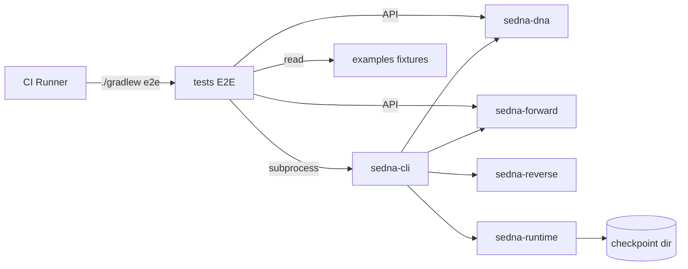

# SEDNA E2E Test Suite — Detailed Design & Build Specification

**Subtitle:** Technical assignment for end-to-end test development  
**System class:** Internal developer platform · Scale-up (v1 foundation, E2E formalization)  
**Domain profile:** Compiler-grade semantic toolchain · determinism as correctness property  
**Scope:** Implement and operate the 31-scenario E2E suite (`docs/sedna_e2e_test_plan.md`) in CI and local dev, aligned with the live CLI and `tests` module.  
**Out of scope:** Word export, UI/browser tests, distributed/cloud orchestration E2E, multi-language pipeline E2E, production Kafka/K8s validation.

| Version | Date | Author | Changes |
|---------|------|--------|---------|
| 1.0 | 2026-05-20 | Spec Forge | Initial contract from repository artifacts |

**Traceability:** Artifact IDs `A1`–`A8` refer to the inventory in §2.1.

---

# SECTION 1 — FOR THE TEAM

## 1.1 Summary (TL;DR)

The project goal is to implement a **deterministic, filesystem-isolated E2E test harness** for the SEDNA semantic DNA platform. The harness validates DNA encode/decode, registry bootstrap, forward and reverse pipelines, runtime replay, mutation safety, training reproducibility, and CLI error contracts through **JUnit 5 integration tests** and **CLI subprocess invocations**, using golden fixtures under `examples/sedna-e2e-tests/`. Success means a senior engineer can run `./gradlew e2e` (or equivalent) on a clean machine and obtain bit-stable, semantically equivalent results without manual path fixes. Non-deterministic outputs constitute a platform failure, not a flaky test.

## 1.2 Context and Goals

**Context.** SEDNA v1 ships core modules (DNA, registry, validation, forward, reverse, runtime, mutation, training, CLI). Integration tests exist in `tests/` but the formal E2E plan (`A1`) predates the unified `sedna-cli` surface (`A6`) and uses obsolete Gradle module names and example paths.

**Goals (measurable):**

| # | Goal | Metric |
|---|------|--------|
| G1 | Map all 31 E2E scenarios to automated tests or documented manual gates | 31/31 traced in §2.4 |
| G2 | Enforce per-test filesystem isolation | 100% tests use `build/test-outputs/<test-id>/` |
| G3 | Preserve golden DNA bytes | SHA-256 `6d75d843…ed8f5` stable across CI runs |
| G4 | Validate core chain encode → decode → forward → compile → reverse → equivalence | Chain passes on `cms-reference` + golden fixture |
| G5 | CI runs E2E without PostgreSQL for default profile | File checkpoint store; JDBC optional |
| G6 | Performance gates via JMH, not blocking unit E2E | p95 targets from `A3` |

**Anti-goals:**

- E2E does **not** prove multi-tenant SaaS isolation, mobile store compliance, or GDPR data-subject APIs.
- E2E does **not** require live LLM calls (`SEDNA_LLM_ENABLED=false` in CI).
- E2E does **not** validate Kotlin/TypeScript pipelines (post–v1.x per `A4`).
- E2E does **not** replace module unit tests; it composes cross-module contracts only.

## 1.3 Functional Architecture (Three Layers)

Classification follows **irreplaceability for the E2E product** (the test system itself), not SEDNA end-user features.

### 1.3.A Differentiating Core

**DC-1 — Determinism oracle**

*Description:* Every E2E assertion compares canonical hashes or semantic equivalence, never wall-clock timestamps or unordered collections.

*Mechanism:* `CanonicalOrdering.comparator()`, `SemanticEquivalenceChecker`, `TraceHasher.sha256`, TreeMap-ordered file hashes (`CiDeterminismTest` pattern `A5`).

*Why it works:* SEDNA’s value proposition is compiler-grade reproducibility; without hash gates, pipeline drift hides in “green” functional tests.

*Key risk:* Floating-point embeddings (E2E-022) break byte equality — mitigated by cosine ≥ 0.9999 and ε ≤ 1e-6 per `A1`.

**DC-2 — Golden fixture contract**

*Description:* Hand-authored `cms-reference-fixture.sdna` anchors DNA bytes independent of reverse pipeline timing.

*Mechanism:* `CmsReferenceFixtureGraph` → encoder → byte identity vs on-disk fixture; README SHA documented in `examples/docs/cms-reference-fixture.md`.

*Why it works:* Reverse extraction introduces AST ordering sensitivity; golden bytes isolate DNA codec regressions.

*Key risk:* Vocabulary bump changes NodeIDs — requires intentional fixture regeneration with committed SHA update.

**DC-3 — Reverse/forward semantic equivalence chain**

*Description:* Proves `reverse(forward(dna))` preserves NodeID set, contracts, constraints, and motif-expanded topology.

*Mechanism:* `SpringBootReverseForwardEquivalenceTest`, `SemanticEquivalenceChecker`, `SednaFoldMotifCodec.expand` (`A5`, `A7`).

*Why it works:* Catches cross-module contract drift that unit tests in a single module miss.

*Key risk:* LLM-filled method bodies — mitigated by `DisabledLlmClient` / `SEDNA_LLM_ENABLED=false`.

### 1.3.B Enabling

- **E2E test workspace layout:** `build/test-outputs/<test-id>/` per `A1`.
- **CLI subprocess runner:** Gradle `:sedna-cli:run` with `--format=json` for machine-parseable status.
- **Example project resolver:** `RepoPaths` + `ExamplesLayout` for `sedna-cms`, `sedna-demo` trees.
- **JUnit 5 + @TempDir:** Isolated generated trees (`ForwardCompileIntegrationTest`).
- **Registry bootstrap:** `InMemorySemanticRegistry.bootstrap()` before validation/forward.
- **ArchUnit module boundaries:** `ModuleArchitectureTest` prevents illegal cross-deps.
- **Spotless/SpotBugs/Gradle build:** CI precondition before E2E.

### 1.3.C Periphery

- JMH benchmark reporting (E2E-026–028) as non-blocking CI job.
- Graphviz DOT export smoke (`Phase14AcceptanceTest`).
- Training corpus manifest checksum artifacts.
- PostgreSQL JDBC checkpoint path (optional developer profile).

### 1.3.D Comparison (test approach vs typical Java integration tests)

| Criterion | SEDNA E2E suite | Typical Spring integration tests |
|-----------|-----------------|----------------------------------|
| Primary oracle | Semantic graph + byte/hash identity | HTTP status / DB row counts |
| Ordering guarantee | Canonical NodeID + topology | Often undefined |
| Cross-pipeline scope | DNA ↔ code ↔ runtime replay | Single deployable unit |
| Failure interpretation | Determinism regression = P0 bug | Often retried as flaky |
| Fixture strategy | Golden `.sdna` bytes + Spring sample apps | In-memory H2 + `@Sql` |

### 1.3.E Segment Adaptation (Internal-tool)

Comparison target is **manual operator workflows** (README minimal workflow, `docs/operator-guide.md`) vs the automated suite. Success metric: operator guide commands are a subset of CLI-driven E2E steps.

## 1.4 Users and Roles

| Role | Who | Activity | Key rights |
|------|-----|----------|------------|
| Platform engineer | Human developer | Runs `./gradlew e2e`, inspects `build/test-outputs/` | Full repo, local Docker optional |
| CI agent | GitHub/GitLab runner | Executes `e2e` job on Linux JDK 21 | Read repo; no LLM secrets |
| AI implementer | Coding agent | Adds tests per `TODO-tests.md` | Must not weaken determinism assertions |
| Release owner | Tech lead | Approves golden SHA changes | Signs off fixture regeneration |

## 1.5 Key Scenarios

**Scenario 1: CI determinism gate**  
Trigger: pull request to main.  
Steps: checkout → `./gradlew build` → `./gradlew e2e` → compare golden SHA, forward tree hash, equivalence suite → publish JUnit XML.  
Outcome: merge blocked on hash mismatch.

**Scenario 2: Local forward compile loop**  
Trigger: engineer changes `sedna-forward`.  
Steps: `sedna forward` on golden fixture → Gradle `build` in isolated output dir → fix generator → re-run `CiDeterminismTest`.  
Outcome: generated project compiles; tree hash stable across two runs.

**Scenario 3: Runtime replay recovery**  
Trigger: runtime checkpoint change.  
Steps: `sedna run --checkpoint-dir=…` → inject failure node → `sedna replay` → assert trace SHA equality.  
Outcome: replay trace hash matches original (`A7` runtime model).

**Scenario 4: Invalid DNA rejection**  
Trigger: validation rule change.  
Steps: load `tests/fixtures/invalid/*.sdna` → `sedna validate --format=json` → assert exit code 1 and stable `ErrorCode`.  
Outcome: deterministic error ordering in report.

**Scenario 5: Deep mutation longevity (E2E-019B)**  
Trigger: mutation engine release.  
Steps: apply 10 constraint-preserving mutations on base DNA → validate → forward compile final graph.  
Outcome: graph valid; no orphan nodes; topology deterministic.

## 1.6 Non-Functional Requirements

| Category | Requirement | Metric |
|----------|-------------|--------|
| Performance (E2E job wall time) | Full `e2e` task on 4-core CI | p95 < 15 min (excl. first Gradle cache miss) |
| Performance (module targets) | DNA decode/encode | < 100 ms warmed (`A3`) |
| Performance | Forward reconstruction | < 5 s on cms-reference fixture |
| Performance | Reverse analysis (cms-reference project) | < 30 s |
| Determinism | Repeated run hash equality | 100% on byte outputs; embeddings per cosine rule |
| Isolation | Parallel E2E safe | No shared mutable dirs under `build/test-outputs/` |
| Observability | CI artifacts | JUnit XML + `reproducibility.report` for training tests |
| Security | Secrets | No `OPENROUTER_API_KEY` in CI; LLM disabled |
| Portability | OS | Linux/macOS primary; Windows supported via `gradlew.bat` in compile tests |

Compliance matrix (HIPAA/PCI): **not applicable** — internal toolchain, no PHI/PCI in fixtures.

## 1.7 Release Plan

| Release | Content | Ready when |
|---------|---------|------------|
| **R0 — Harness** | `E2eTestSupport`, `e2e` Gradle task, output dir convention, CLI runner | `./gradlew e2e` runs ≥1 test |
| **R1 — DNA + validation** | E2E-001–005, 012–013 mapped | Golden SHA + invalid fixtures green |
| **R2 — Pipelines** | E2E-006–011, chain §15 of `A1` | Forward compile + reverse equivalence green |
| **R3 — Runtime + mutation** | E2E-014–019, 019B, 029–030 | Replay + rollback tests green |
| **R4 — Training + CLI** | E2E-020–025, 023 | Corpus manifest checksum stable |
| **R5 — Bench + full determinism** | E2E-026–031, JMH wired | JMH thresholds documented; `FullDeterminismSuite` green |

## 1.8 Risks

| Risk | P | I | Mitigation |
|------|---|---|------------|
| E2E plan CLI paths obsolete | H | H | Canonicalize on `sedna-cli` commands (§2.8); fix `A1` in follow-up PR |
| Windows path flakiness in subprocess tests | M | M | Use `RepoPaths.gradlew`; `@TempDir` only |
| Golden SHA drift on vocabulary change | M | H | Regeneration procedure in fixture README; code review |
| LLM nondeterminism in forward | M | H | `DisabledLlmClient` + env guard in `E2eTestSupport` |
| Missing `e2e` Gradle task blocks automation | H | M | R0 deliverable in `TODO-tests.md` |
| PostgreSQL optional vs plan mandate | L | M | Default file checkpoints; JDBC profile tagged `@Tag("jdbc")` |
| Embedding strict hash false positives | M | M | Apply `A1` float tolerance rules only |

## 1.9 Assumptions

- ✓ Java 21 + Gradle 8.x is the CI standard (`A3`, `A4`).
- ✓ Canonical fixture path is `examples/sedna-e2e-tests/cms-reference-fixture.sdna` (`ExamplesLayout.GOLDEN_CMS_FIXTURE`).
- ✓ Primary Spring reference project is `examples/sedna-cms/cms-reference` (`A5`).
- ✓ Demo fixtures `spring-demo`, `inventory-demo`, `order-demo` remain equivalence targets (`A5`).
- ~ `blog-reference` / `shop-reference` from `A1` §2 — **not present in repo**; equivalence suite uses `sedna-demo` projects instead [scope: fixtures].
- ~ `--clean` flag on CLI — **not implemented** (`A6`); E2E uses fresh `@TempDir` / `Files.createTempDirectory` until CLI adds `--clean` [assumed].
- ✓ Module `tests` replaces fictional `:sedna-tests` from `A1`.

## 1.10 Source Conflicts

| Conflict | Source | Resolution | Rationale |
|----------|--------|------------|-----------|
| Gradle module `:sedna-tests:e2e` vs `:tests` | A1 vs A5/settings.gradle | Use `:tests` + new `e2e` task | Executable reality in repo |
| Per-module `run --args=encode` vs unified CLI | A1 vs A6 | All CLI E2E via `:sedna-cli:run` | Single entry point documented in operator guide |
| Paths `examples/cms-reference`, `examples/dna/*.sdna` | A1 vs A3/A5 | Map to `examples/sedna-cms/cms-reference`, `examples/sedna-e2e-tests/*.sdna` | Actual tree layout |
| `sedna-mutation:run`, `sedna-registry:run` standalone | A1 vs A6 | Implement as JUnit API tests calling engines directly | No CLI subcommands for mutation/registry |
| PostgreSQL required in §2 Software Baseline | A1 vs A5 file checkpoints | PostgreSQL optional; file store default | Operator guide documents both |
| E2E-019 / E2E-019B duplicate heading in A1 | A1 internal | Treat 019B as separate test class | Editorial merge in test plan later |
| `benchmarks:run --args=decode-benchmark` | A1 vs A5 JMH | Use `./gradlew jmh` + benchmark classes | JMH is actual benchmark harness |
| Training commands `generate-dataset`, `discover-motifs` | A1 vs A6 `train` | Map E2E-020–023 to `sedna train` + API tests | CLI consolidates training |

If no further conflicts arise during implementation, this table is the resolution authority.

## 1.11 Prioritization (from E2E plan)

| Marker | Meaning in `A1` | Design mapping |
|--------|-----------------|----------------|
| Chain §15 | Mandatory validation chain | R2 gate — blocks release if broken |
| E2E-031 | Full platform determinism | R5 — aggregate suite |
| E2E-026–028 | Performance | R5 — JMH, non-blocking |
| E2E-019B | Deep mutation longevity | R3 — extended mutation |
| Remaining E2E-00x | Standard coverage | R1–R4 by module group |

## 1.12 Architectural Forks

### Fork 1: E2E invocation style

*Context:* Tests must match operator workflows without duplicating brittle Gradle module `run` tasks.  
*Chosen:* **Hybrid** — programmatic API for fast deterministic checks; CLI subprocess for command contract tests.  
*Alternatives:* CLI-only — rejected: slower, harder to debug; API-only — rejected: misses CLI regression.  
*Risks:* Subprocess tests need stable working directory — mitigated by `E2eTestSupport.runCli`.

### Fork 2: Output isolation

*Context:* Parallel CI must not reuse `generated/` or `/tmp` paths.  
*Chosen:* `build/test-outputs/<test-id>/` + JUnit `@TempDir` for unit-scoped trees.  
*Alternatives:* Global `build/e2e` — rejected: parallel unsafe; only `/tmp` — rejected: non-reproducible paths on Windows.  
*Risks:* Disk usage — mitigated by CI workspace cleanup.

### Fork 3: Equivalence oracle

*Context:* Byte equality too strict after forward codegen; graph equivalence required.  
*Chosen:* `SemanticEquivalenceChecker` on motif-expanded graphs for reverse/forward; byte equality for DNA only.  
*Alternatives:* Source file diff — rejected: non-canonical formatting; byte-compare generated Java — rejected: LLM/template whitespace.  
*Risks:* Equivalence checker bugs — mitigated by fixed golden fixture with known node count.

### Fork 4: Benchmark placement

*Context:* Performance targets must not slow PR E2E.  
*Chosen:* JMH in `benchmarks/` as separate CI job.  
*Alternatives:* Inline assert timing in JUnit — rejected: flaky on shared runners.  
*Risks:* JMH environment variance — document warmed JVM in benchmark README.

---

# SECTION 2 — FOR BUILD (LLM / IMPLEMENTER)

## 2.1 System Context

The development goal is to build the **SEDNA E2E verification layer**: JUnit 5 tests in `tests/src/test/java/io/sedna/tests/e2e/`, shared support utilities, fixture corpora under `tests/fixtures/`, and Gradle task `e2e` that executes tagged integration tests with LLM disabled and isolated outputs. Stack: Java 21, Gradle Kotlin DSL, JUnit 5, JMH (benchmarks), sedna-cli subprocess, optional PostgreSQL 16 for JDBC-tagged tests. Out of scope: new product features in sedna-core pipelines except `--clean` if added for E2E ergonomics.

## 2.1.1 Architecture (C4 Container)

| Component | Type | Technology | Incoming | Outgoing |
|-----------|------|------------|----------|----------|
| Developer / CI | External | Human / GitHub Actions | — | → Gradle Wrapper (CLI) |
| Gradle Wrapper | Build | Gradle 8.x | ← Developer/CI | → tests module, sedna-cli |
| tests (E2E) | Test harness | JUnit 5 | ← Gradle `e2e` task | → All sedna-* libraries, sedna-cli process |
| sedna-cli | CLI | Java 21 | ← tests subprocess, Developer | → sedna-dna, forward, reverse, runtime, validation, training |
| sedna-dna | Library | Java TLV codec | ← CLI, tests | → sedna-core, sedna-registry |
| sedna-registry | Library | In-memory registry | ← All pipelines | → sedna-core |
| sedna-validation | Library | Graph rules | ← CLI validate | → sedna-core, registry |
| sedna-forward | Library | JavaPoet codegen | ← CLI forward | → validation, registry, LLM HTTP (off in E2E) |
| sedna-reverse | Library | Spoon/JavaParser | ← CLI reverse | → validation, registry |
| sedna-runtime | Library | Project Reactor | ← CLI run/replay | → persistence, validation |
| sedna-mutation | Library | Subtree rewrite | ← tests API only | → validation |
| sedna-training | Library | Corpus pipeline | ← CLI train | → reverse, registry |
| sedna-persistence | Library | File/JDBC checkpoints | ← runtime | → PostgreSQL (optional External) |
| examples/* | Fixtures | .sdna, Spring projects | ← tests read | — |
| benchmarks | JMH | JMH 1.x | ← Gradle `jmh` | → sedna-* APIs |
| PostgreSQL | External | PG 16 | ← JDBC tests | — |

## 2.2 Design Tokens

**Not applicable** — no UI. Recorded in assumptions: E2E is headless CLI/API only.

## 2.3 Data Model (Test Artifacts)

| Entity | Field | Type | Required | Notes |
|--------|-------|------|----------|-------|
| E2eRun | testId | string | ✓ | e.g. `E2E-003` |
| E2eRun | outputDir | path | ✓ | `build/test-outputs/<test-id>/` |
| E2eRun | exitCode | int | ✓ | 0 success; 1 semantic; 2 usage |
| E2eRun | stdoutJson | string | — | when `--format=json` |
| GoldenFixture | path | path | ✓ | `cms-reference-fixture.sdna` |
| GoldenFixture | sha256 | hex(64) | ✓ | `6d75d8431baaac07398e39448b19db34b62cc6df7eb84cbdc1484d5c2d7ed8f5` |
| GoldenFixture | nodeCount | int | ✓ | 3 nodes, 1 link |
| InvalidFixture | path | path | ✓ | under `tests/fixtures/invalid/` |
| InvalidFixture | expectedErrorCode | ErrorCode | ✓ | first error stable |
| GeneratedProject | root | path | ✓ | forward output tree |
| GeneratedProject | treeHash | hex(64) | ✓ | canonical path→content hash |
| ExecutionTrace | traceSha256 | hex(64) | ✓ | from `TraceHasher` |
| TrainingArtifacts | manifestPath | path | ✓ | from `TrainingDatasetWriter` |
| TrainingArtifacts | manifestSha256 | hex(64) | ✓ | checksum sidecar |
| EmbeddingVector | dimensions | int[] | ✓ | float tolerance ε ≤ 1e-6 |
| EmbeddingVector | cosineMin | decimal | ✓ | ≥ 0.9999 across runs |

## 2.4 Functional Requirements (by module)

Format: `FR-<module>.<N> [scope|assumed]: Imperative statement.`

### sedna-dna

- FR-dna.01 [scope: E2E-001]: The suite encodes `CmsReferenceFixtureGraph` to TLV bytes and asserts SHA-256 matches the golden fixture file.
- FR-dna.02 [scope: E2E-002]: The suite decodes `cms-reference-fixture.sdna` and asserts node count, link count, and `registry=core:1.0`.
- FR-dna.03 [scope: E2E-003]: The suite asserts `encode(decode(bytes))` is byte-identical to input bytes across 3 consecutive runs.

### sedna-registry

- FR-reg.01 [scope: E2E-004]: The suite bootstraps `InMemorySemanticRegistry` and resolves all contract refs in the golden graph without `UNRESOLVED` errors.
- FR-reg.02 [scope: E2E-005]: The suite loads conflicting registry extension fixtures and asserts deterministic conflict report ordering (no silent overwrite).

### sedna-forward

- FR-fwd.01 [scope: E2E-006]: The suite runs `sedna forward --input=<golden> --output=<dir>` and asserts a Gradle build file exists under output.
- FR-fwd.02 [scope: E2E-007]: The suite executes `gradlew build` on the generated tree; process exit code is 0 within 10 minutes.
- FR-fwd.03 [scope: E2E-008]: The suite computes `treeHash` for two forward runs; hashes are identical (LLM disabled).

### sedna-reverse

- FR-rev.01 [scope: E2E-009]: The suite runs `sedna reverse --input=examples/sedna-cms/cms-reference` and produces non-empty `.sdna`.
- FR-rev.02 [scope: E2E-010]: The suite asserts `SemanticEquivalenceChecker` passes on `reverse(forward(fixture))` after motif expansion.
- FR-rev.03 [scope: E2E-011, assumed]: Git trajectory extraction test is **deferred** until `extract-trajectories` CLI exists; placeholder documents skip reason.

### sedna-validation

- FR-val.01 [scope: E2E-012]: `sedna validate --input=<golden> --format=json` exits 0.
- FR-val.02 [scope: E2E-013]: `sedna validate` on invalid fixtures exits 1; first `ErrorCode` stable across runs.

### sedna-runtime

- FR-rt.01 [scope: E2E-014]: `sedna run --input=<golden> --format=json` exits 0; trace event order canonical.
- FR-rt.02 [scope: E2E-015]: After run with `--checkpoint-dir`, `sedna replay` yields identical `traceSha256`.
- FR-rt.03 [scope: E2E-016]: Recovery after injected failure node restores checkpoint and completes replay.
- FR-rt.04 [scope: E2E-030]: Interrupted run simulation resumes from last checkpoint with identical final trace hash.

### sedna-mutation

- FR-mut.01 [scope: E2E-017]: Subtree mutation from JSON fixture produces valid DNA passing validation.
- FR-mut.02 [scope: E2E-018]: Rollback restores byte-level or equivalence-level pre-mutation graph.
- FR-mut.03 [scope: E2E-019]: Cross-domain invalid mutation returns `Result.err` without graph mutation.
- FR-mut.04 [scope: E2E-019B]: Ten sequential valid mutations keep graph valid and forward compiles.

### sedna-training

- FR-trn.01 [scope: E2E-020]: `sedna train --corpus=<repo>` writes `dataset.manifest` with deterministic ordering.
- FR-trn.02 [scope: E2E-021, assumed]: Motif discovery assertions run on training pipeline API until CLI exposes `discover-motifs`.
- FR-trn.03 [scope: E2E-022]: Embedding vectors match within ε; cosine similarity ≥ 0.9999 across 3 runs (no byte hash on floats).
- FR-trn.04 [scope: E2E-023]: Registry learning output list ordering is lexicographically stable.

### sedna-cli

- FR-cli.01 [scope: E2E-024]: `sedna help` exits 0; stdout contains `forward`, `reverse`, `validate`.
- FR-cli.02 [scope: E2E-025]: Unknown flag exits 2; stderr/JSON message stable.

### benchmarks / platform

- FR-perf.01 [scope: E2E-026]: JMH `DnaCodecBenchmark` decode p99 < 100 ms warmed on reference fixture.
- FR-perf.02 [scope: E2E-027]: JMH `ForwardPipelineBenchmark` p99 < 5 s on golden fixture.
- FR-perf.03 [scope: E2E-028]: JMH `ReversePipelineBenchmark` p99 < 30 s on cms-reference.
- FR-plat.01 [scope: E2E-029]: Corrupted registry snapshot triggers bootstrap recovery path with deterministic outcome.
- FR-plat.02 [scope: E2E-031]: `FullDeterminismSuite` aggregates DNA, forward hash, validate, replay in one `@Tag("e2e")` class.

### harness (new)

- FR-harness.01 [scope: isolation]: Every E2E test method receives a unique `Path` under `build/test-outputs/<test-id>/`.
- FR-harness.02 [scope: isolation]: Parallel E2E execution sets `junit.jupiter.execution.parallel.enabled=true` only after per-class isolation verified.
- FR-harness.03 [assumed]: When CLI gains `--clean`, tests pass `--clean` before forward/reverse writes; until then, `E2eTestSupport.prepareDir` deletes recursively.

## 2.5 State Machines

**Not applicable** to the test harness. Runtime profile FSM transitions are validated indirectly via E2E-014–016 under `ExecutionProfile` DAG/STATEFUL/SUPERVISOR — see `docs/sedna_execution_semantics_runtime_model.md`.

## 2.6 Destructive Operations

**Not applicable** — tests use ephemeral directories; no user-facing delete/archive APIs in E2E scope.

## 2.7 Notification Registry

**Not applicable** — no user notifications in E2E system.

## 2.8 CLI Command Registry (canonical for E2E)

All commands via `./gradlew :sedna-cli:run --args="<command> ..."` or `installDist` binary.

| Command | Args | Exit 0 means |
|---------|------|--------------|
| help | — | Usage printed |
| encode | `--input`, `--output?` | Canonical DNA written |
| decode | `--input` | Graph summary printed |
| validate | `--input`, `--format=json?` | Graph valid |
| forward | `--input`, `--output?` | Project tree written |
| reverse | `--input`, `--output?` | DNA written |
| run | `--input`, `--checkpoint-dir?`, `--profile?`, `--format=json?` | Trace produced |
| replay | `--checkpoint-dir`, `--checkpoint-sequence?`, `--format=json?` | Trace reproduced |
| diff | `--left`, `--right`, `--format=json?` | Graphs equivalent |
| visualize | `--input`, `--output?` | DOT written |
| monitor | `--input`, `--port?` | HTTP trace exposed |
| train | `--corpus` \| `--projects`, `--output?`, `--format=json?` | Manifest written |

**Missing from CLI (API tests only):** `mutate`, `rollback`, `bootstrap`, `validate-conflicts`, `extract-trajectories`, `recover`.

## 2.9 Screens and Navigation

**Not applicable.**

## 2.10 User Flows (Test Execution)

### Flow: Core validation chain (A1 §15)

| # | Actor | Action | API / Command | System response |
|---|-------|--------|---------------|-----------------|
| 1 | Test | Encode graph | API `DnaServices.encoder` | Bytes + SHA-256 |
| 2 | Test | Decode golden | API `DnaServices.decoder` | Graph 3 nodes |
| 3 | Test | Forward | CLI `forward --input=fixture --output=<dir>` | Gradle tree |
| 4 | Test | Compile | `gradlew -p <dir> build` | Exit 0 |
| 5 | Test | Reverse generated | CLI `reverse --input=<dir>` | `.sdna` file |
| 6 | Test | Equivalence | API `SemanticEquivalenceChecker` | ok |

### Flow: Runtime replay

| # | Actor | Action | API / Command | System response |
|---|-------|--------|---------------|-----------------|
| 1 | Test | Run DAG | CLI `run --checkpoint-dir=<dir>` | traceSha256=A |
| 2 | Test | Replay | CLI `replay --checkpoint-dir=<dir>` | traceSha256=A |
| ↳ alt | Test | Inject failure | `--inject-failure-node-id` | run fails at node |
| 3 | Test | Replay after checkpoint | CLI `replay` | trace completes |

### Flow: CI full e2e

| # | Actor | Action | API / Command | System response |
|---|-------|--------|---------------|-----------------|
| 1 | CI | Build | `./gradlew build` | Success |
| 2 | CI | E2E | `./gradlew e2e` | JUnit green |
| 3 | CI | Benchmarks (main only) | `./gradlew jmh` | Reports within thresholds |

## 2.11 Stack

| Layer | Technology | Rationale |
|-------|------------|-----------|
| Language | Java 21 | Platform standard (`A3`) |
| Build | Gradle Kotlin DSL | Multi-module repo |
| Unit/E2E | JUnit 5 | Existing `tests` module |
| Benchmarks | JMH | `benchmarks/` module |
| CLI | sedna-cli | Operator-facing contract |
| AST | Spoon / JavaParser | Reverse E2E |
| Codegen | JavaPoet | Forward compile E2E |
| Persistence | FileCheckpointStore (+ optional PG) | Replay without DB in CI |
| Assertions | JUnit + custom hash helpers | Deterministic oracles |

## 2.12 E2E Scenario Traceability Matrix

| ID | Title | Implementation target | Current status |
|----|-------|----------------------|----------------|
| E2E-001 | DNA Encode | `DnaEncodeE2eTest` | Partial (`CiDeterminismTest`) |
| E2E-002 | DNA Decode | `DnaDecodeE2eTest` | Partial (decoder in multiple tests) |
| E2E-003 | DNA Roundtrip | `DnaRoundtripE2eTest` | Partial (`CiDeterminismTest.encodeDecodeBytesAreStable`) |
| E2E-004 | Registry Bootstrap | `RegistryBootstrapE2eTest` | Partial (implicit in pipelines) |
| E2E-005 | Registry Conflicts | `RegistryConflictE2eTest` | Missing |
| E2E-006 | Forward Generate | `ForwardGenerateE2eTest` | Partial (CLI + API) |
| E2E-007 | Generated Compile | `ForwardCompileE2eTest` | Done (`ForwardCompileIntegrationTest`) |
| E2E-008 | Forward Determinism | `ForwardDeterminismE2eTest` | Partial (`CiDeterminismTest.forwardOutputTreeHashIsStable`) |
| E2E-009 | Reverse Analysis | `ReverseAnalysisE2eTest` | Partial (`Phase14AcceptanceTest`) |
| E2E-010 | Reverse/Forward Equiv | `ReverseForwardEquivalenceE2eTest` | Done (`SpringBootReverseForwardEquivalenceTest`) |
| E2E-011 | Git Trajectories | — | Deferred (no CLI) |
| E2E-012 | Semantic Validation | `ValidateGoldenE2eTest` | Partial (manual CLI) |
| E2E-013 | Invalid Graph | `ValidateInvalidE2eTest` | Missing fixtures |
| E2E-014 | DAG Runtime | `RuntimeDagE2eTest` | Missing dedicated E2E |
| E2E-015 | Runtime Replay | `RuntimeReplayE2eTest` | Missing dedicated E2E |
| E2E-016 | Checkpoint Recovery | `RuntimeRecoveryE2eTest` | Missing |
| E2E-017 | Subtree Mutation | `MutationApplyE2eTest` | Partial (`MutationFuzzTest`) |
| E2E-018 | Mutation Rollback | `MutationRollbackE2eTest` | Partial |
| E2E-019 | Invalid Mutation | `MutationRejectE2eTest` | Partial |
| E2E-019B | Deep Mutation Drift | `DeepMutationDriftE2eTest` | Missing |
| E2E-020 | Training Dataset | `TrainingDatasetE2eTest` | Partial (train CLI) |
| E2E-021 | Motif Discovery | `MotifDiscoveryE2eTest` | Missing |
| E2E-022 | Embeddings | `EmbeddingStabilityE2eTest` | Missing |
| E2E-023 | Registry Learning | `RegistryLearningE2eTest` | Missing |
| E2E-024 | CLI Help | `CliHelpE2eTest` | Missing |
| E2E-025 | Invalid CLI Args | `CliInvalidArgsE2eTest` | Missing |
| E2E-026 | DNA Benchmark | JMH `DnaCodecBenchmark` | Exists (not gated in E2E) |
| E2E-027 | Forward Benchmark | JMH `ForwardPipelineBenchmark` | Exists |
| E2E-028 | Reverse Benchmark | JMH `ReversePipelineBenchmark` | Exists |
| E2E-029 | Registry Recovery | `RegistryRecoveryE2eTest` | Missing |
| E2E-030 | Interrupted Runtime | `InterruptedRuntimeE2eTest` | Missing |
| E2E-031 | Full Determinism | `FullDeterminismSuite` | Partial (split across tests) |

---

# APPENDIX A — Artifact Inventory

| ID | Type | Maturity | Source | Role |
|----|------|----------|--------|------|
| A1 | T2 | L2 | `docs/sedna_e2e_test_plan.md` | Scenario catalog |
| A2 | T2 | L3 | `AGENTS.md` | Determinism and mutation rules |
| A3 | T2 | L3 | `README.md` | Architecture, performance targets |
| A4 | T2 | L2 | `ROADMAP.md` | Phase acceptance alignment |
| A5 | T3 | L4 | `tests/src/test/java/io/sedna/tests/*.java` | Existing coverage baseline |
| A6 | T3 | L3 | `sedna-cli/.../SednaCli.java` | CLI contract |
| A7 | T2 | L3 | `docs/sedna_*_specification*.md`, runtime model | Semantic contracts |
| A8 | T2 | L3 | `docs/sedna_technical_assignment.md` | Bootstrap order, DTO rules |

---

# APPENDIX B — Quality Gates (pre-merge)

- [ ] All FR-harness isolation rules implemented
- [ ] E2E traceability matrix: no `Missing` for R0–R2 scenarios
- [ ] Golden SHA unchanged or intentionally updated in README + test constants
- [ ] LLM disabled in `E2eTestSupport` environment
- [ ] Section 1.10 conflicts resolved in code paths (no `examples/dna/` references)
- [ ] `./gradlew e2e` documented in README / operator-guide
- [ ] Non-deterministic assertion introduced → test fails CI

*End of document.*
